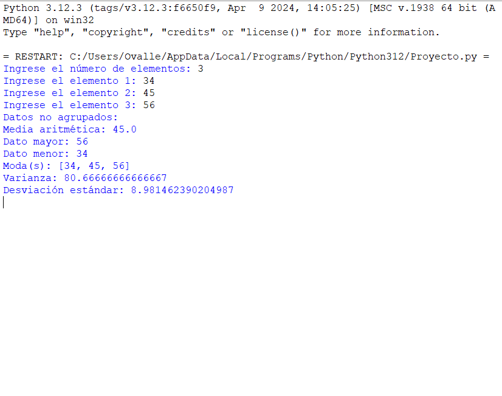

# **Programa de Estadísticas para Datos Agrupados y No Agrupados**

Este es un proyecto desarrollado en Python que calcula estadísticas tanto para datos no agrupados (menos de 30 elementos) como para datos agrupados (30 o más elementos). El programa es capaz de calcular la media aritmética, moda, varianza, desviación estándar, entre otros indicadores, y adapta los cálculos dependiendo del tipo de datos que el usuario ingrese.



## **Instalación**

Para ejecutar este proyecto en tu máquina local, sigue estos pasos:

1. Clona este repositorio a tu máquina local utilizando el siguiente comando:

    ```bash
    git clone "URL del repositorio"
    ```

2. Navega al directorio del proyecto:

    ```bash
    cd "nombre del directorio"
    ```

3. Instala Python si no lo tienes instalado. Puedes descargar la última versión de [python.org](https://www.python.org/downloads/).

4. Asegúrate de que tienes las bibliotecas necesarias instaladas (aunque todas forman parte del paquete estándar de Python). Si es necesario, ejecuta:

    ```bash
    pip install math
    pip install statistics
    ```

5. Ejecuta el programa desde la terminal:

    ```bash
    python proyecto.py
    ```

## **Estructura del Proyecto**

- `proyecto.py`: el archivo principal que contiene todo el código fuente del proyecto.
- `docs/`: esta carpeta contiene los recursos, imágenes y documentación del proyecto.

## **Descripción del Programa**

El programa solicita al usuario ingresar el número de elementos que tiene su muestra, y de acuerdo a ese número, realiza los cálculos correspondientes para datos agrupados o no agrupados.

- Para **datos no agrupados**:
  - Calcula media aritmética, dato mayor, dato menor, moda, varianza y desviación estándar.
  
- Para **datos agrupados**:
  - Genera la tabla de frecuencias y calcula la media aritmética, moda, varianza y desviación estándar.

## **Ejemplo de Ejecución**

```plaintext
Ingrese el número de elementos: 25
Ingrese el elemento 1: 4
Ingrese el elemento 2: 8
...
Datos no agrupados:
Media aritmética: 13.2
Dato mayor: 23
Dato menor: 4
Moda(s): [4]
Varianza: 41.36
Desviación estándar: 6.43
